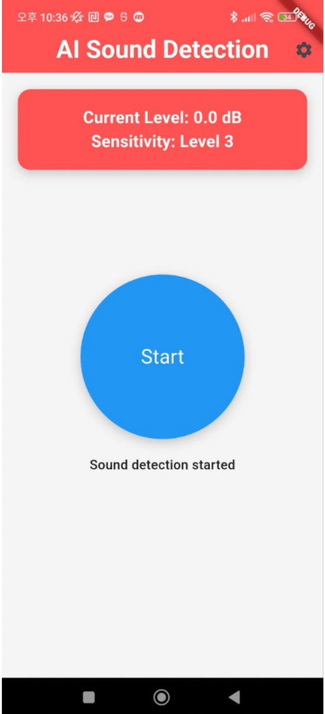

# 2024-02-CSC4004-1-4-Team4

## 🚀 Alrimping  
**"위험한 소리, 놓치지 마세요!"**  
AI 기반으로 주변의 위험 소리를 감지하여 사용자에게 경고를 주는 스마트 안전 앱입니다.

    
    

      
    

---

## 📱 앱 소개  
Alrimping은 다음과 같은 기능을 제공합니다:  
- **AI 소리 감지**: 위험한 소리(차 경적, 비명 등)를 실시간 분석.  
- **스마트 알림**: 배경에서 동작하며 팝업으로 사용자에게 경고.  
- **디자인 중심 UI**: 사용하기 쉬운 직관적인 인터페이스.

---

## ⚙️ 기술 스택  
- **프론트엔드**: Flutter  
- **백엔드**: TensorFlow 기반 AI 모델  
- **사운드 감지**: Noise Meter 패키지  
- **디자인 툴**: Figma  

---

## 👨‍👩‍👧‍👦 팀원 소개  

| 팀원 명   | 역할       |  
|-----------|------------|  
| **서동건** | 팀장       |  
| **이준원** | 팀원       |  
| **홍준표** | 팀원       |  
| **이예림** | 팀원       |  
| **떠진코** | 팀원       |  

---

## 📂 프로젝트 구조  
### file struct
#### /lib  ######
 #### ── main.dart                  // 앱의 진입점
 #### ── screens                    // 앱의 각 화면 폴더
 ###### │   ── home_screen.dart
 ###### │   ── settings_screen.dart
 ###### │   ── alert_screen.dart
 #### ── widgets                    // 재사용 가능한 위젯 정의 폴더
 ###### │   ── custom_button.dart
 ###### │   ── custom_dialog.dart
 #### ── models                     // 데이터 모델 정의 폴더
 ###### │   ── sound_model.dart
 ###### │   ── detection_result.dart       // AI 분석 결과 모델
 #### ── providers                  // 상태 관리 및 로직 제공 폴더
 ###### │   ── sound_provider.dart
 ###### │   ── detection_provider.dart     // AI 감지 관련 상태 관리
 ###### │   ── background_task_provider.dart  // 백그라운드 작업 관리
 #### ── services                   // API 및 AI 모델 관련 서비스 폴더
 ###### │   ── sound_detection_service.dart   // 소리 감지 및 AI 분석 기능
 ###### │   ── ai_api_service.dart            // 외부 AI API 호출
 ###### │   ── background_service.dart        // 백그라운드 작업 설정 및 관리
 ###### │   ── notification_service.dart      // 팝업 알림 관리
 #### ── utils                      // 유틸리티 클래스 및 함수 폴더
 ######     ── alert_utils.dart

