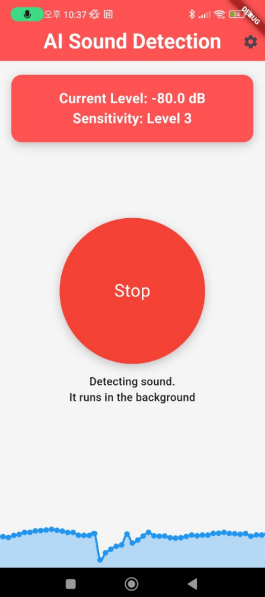
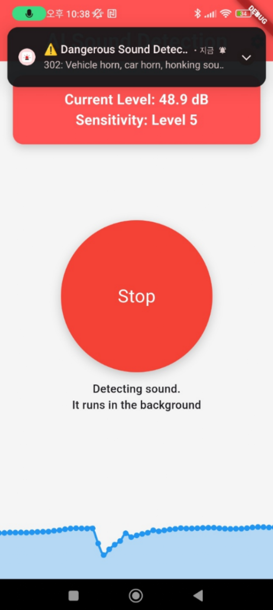
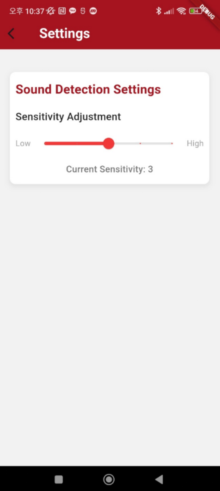

<!DOCTYPE html>
<html lang="ko">
<head>
    <meta charset="UTF-8">
    <meta name="viewport" content="width=device-width, initial-scale=1.0">
    <title>Alrimping - AI 스마트 안전 앱</title>
    
</head>
<body>
    

        

            
            <h1>🚀 Alrimping</h1>
            
<strong>"위험한 소리, 놓치지 마세요!"</strong>

        

        <h2>📱 앱 소개</h2>
        <ul>
            <li><strong>AI 소리 감지:</strong> 위험한 소리(차 경적, 비명 등)를 실시간 분석.</li>
            <li><strong>스마트 알림:</strong> 배경에서 동작하며 팝업으로 사용자에게 경고.</li>
            <li><strong>디자인 중심 UI:</strong> 사용하기 쉬운 직관적인 인터페이스.</li>
        </ul>

        

            
            
            
            
        

        <h2>⚙️ 기술 스택</h2>
        <ul>
            <li><strong>프론트엔드:</strong> Flutter</li>
            <li><strong>백엔드:</strong> TensorFlow 기반 AI 모델</li>
            <li><strong>사운드 감지:</strong> Noise Meter 패키지</li>
            <li><strong>디자인 툴:</strong> Figma</li>
        </ul>

        <h2>📂 프로젝트 구조</h2>
        <pre>
/lib
 ├── main.dart                // 앱의 진입점
 ├── screens                 // 앱의 각 화면 폴더
 │    ├── home_screen.dart
 │    ├── settings_screen.dart
 ├── services                // API 및 AI 모델 관련 서비스 폴더
 │    ├── audio_detection_manager.dart // 소리 감지 및 AI 분석 기능
 │    ├── notification_service.dart    // 팝업 알림 관리
        </pre>

        <h2>👨‍👩‍👧‍👦 팀원 소개</h2>
        <table class="team-table">
            <thead>
                <tr>
                    <th>팀원 명</th>
                    <th>역할</th>
                </tr>
            </thead>
            <tbody>
                <tr>
                    <td>서동건</td>
                    <td>팀장: 프로젝트 설계, 디자인(UI), 프론트, 백엔드, 출시 및 발표</td>
                </tr>
                <tr>
                    <td>이준원</td>
                    <td>백엔드 개발 총괄 (음성 AI 모델 YAMNet 연동, 음성 스트리밍 등)</td>
                </tr>
                <tr>
                    <td>홍준표</td>
                    <td>백엔드(마이크 권한 획득, 마이크 테스트), YAMNet 적용, 인식률 테스트</td>
                </tr>
                <tr>
                    <td>이예림</td>
                    <td>UI 디자인 및 모바일 프론트엔드, 자료 조사 및 백엔드 보조</td>
                </tr>
                <tr>
                    <td>떠진코</td>
                    <td>전반적인 진행 과정 테스트, 자료 조사</td>
                </tr>
            </tbody>
        </table>

        

            &copy; 2024 Alrimping. All rights reserved.
        

    

</body>
</html>
